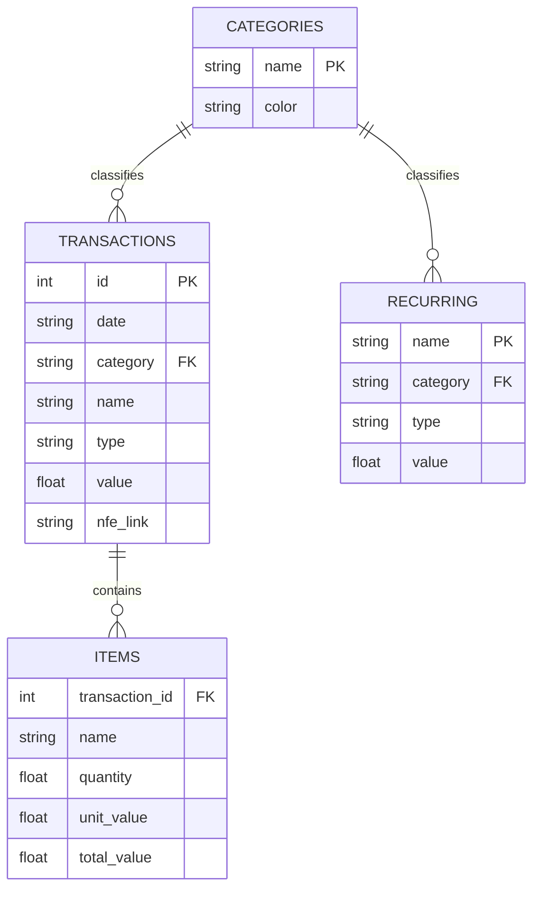

## 1. Project Overview
**Flux-Ledger** is a cloud-based personal finance management system built with **Python** and **Streamlit**. It uses **Google Sheets** as a serverless backend to ensure data accessibility across different devices while maintaining a "Zero-Cost" infrastructure.

### Tech Stack:
* **Frontend:** Streamlit
* **Backend:** Google Sheets API (via `gspread`)
* **Data Processing:** Pandas
* **Visualization:** Plotly
* **IDE:** Cursor AI

---

## 2. Data Architecture (Google Sheets)
The database consists of four tables (worksheets):

---

## 3. Page Specifications

### Page 1: Transactions Page
Goal: Provide a real-time transactions page to understand all the incomes and outcomes in a given period of time.

* **Core Calculation:**
    `Balance = Income - Expenses`
* **Must have:**
    1. Stacked Bar Graph showing the amount spent with: 
     - Date filters and Category filters
     - Categories represent different colors in the same bar.
     - Yearly (bars are months) and monthly (bars are days) view. Should be able to toggle between them

### Page 2: Add Info

* **Page Objective:**
Enable the user to insert expenses data in the database via UI.

* **Must Have:**
    1. A selectable square to select between:
        - Categories
        - Transactions
        - Recurring
    2. When transactions is selected: 
        2.1. A dropdown menu to choose from:
            - Category
            - Type
        2.2. A text input box for
            - Name
            - Value
            - NFE-link
        2.3. A date picker for date
    3. When Categories is selected:
        3.1 A color Picker
        3.2 A input box for Name
    4. When Recurring is selected:
        4.1. A dropdown menu to choose from:
            - Category
            - Type
        4.2. A text input box for
            - Name
            - Value

* **Additional Beahvior:**
    - The app should have a 'memory', so the last entries of the user are stored. This can be stored in a simple JSON file. 
    - As the user adds things, it should be stored in a local list, until the user clicks in 'Upload'.
    - The upload button should trigger a function that will:
        - Fetch the latest data online and check the latest ID.
        - Add the new items with an assured unique ID.

### Page 3: Recurring Expenses

* **Page Objective**: Let the user define the expected income and expenses for each category monthly. This should help to compare, for each month, how much has been spent for each category and whether should reduce costs or not.

* **Must Have:**
    1. A waterfall chart, where:
        1.1. The first bar represents the sum of income, and should be the tallest. This bar should be green.
        1.2. The following bars represent the cost of each category, reducing the income bar. These bars should be red.
        1.3. When hovering the mouse ouver each bar, the user should be able to see a tooltip with:
            - All the items inside that category that sum up to the total value.
            - The % that item represents of the total income for each item.
            - NEW: The total amount of the category followed by the % that the entire category represents of the total income
         

### Page 4: Items Page
* **Page Objective**: This page should allow the user to check specific items that were bought inside a given transaction.

* **Must Have:**
    1. A selectable square to select between:
        - Analysis
        - Add NFE
    2. When 'Analysis' is selected, the user should see a page where he can expand transactions and see their items.
        - This should show a list of transactions with a expandable button, which will them show:
            - A table with :
                - All the items and its columns (except for transaction_id).
                - The last column should be the the % of the total value the item in relation to the total value of the transaction
    3. When 'Add NFE' is selected, a section to add items should appear:
        - It should show a list of the last 20 transactions and allow the user to add a link to the receipt for that given transaction.
        - Once the user has added the transactions it selected, a button should appear with the text 'Upload'
        - When upload has been clicked, it should call the function extract_nfce_data() from the nfe_scrape file inside the services module, waiting for the return of the data.
        - Finally, once the data is returned and the items are fecthed, it should upload the items to the Items table.
* **Notes:**
    - When the user add a link to the transaction, the column 'nfe_link' of the transaction in the Transactions table should be filled with this information.
    - When upload is clicked, there should be a check to see if there are rows in the Items table with that Transaction ID. If so, a warning should appear warning this and asking if if should proceed.

* **General Guides:**
    - For User Experience purpouses, the fecthed DFs should be stored in cache and shared between pages, this way there would be no need to wait sometime every page change. However, every page should have a button that can refresh the data.
